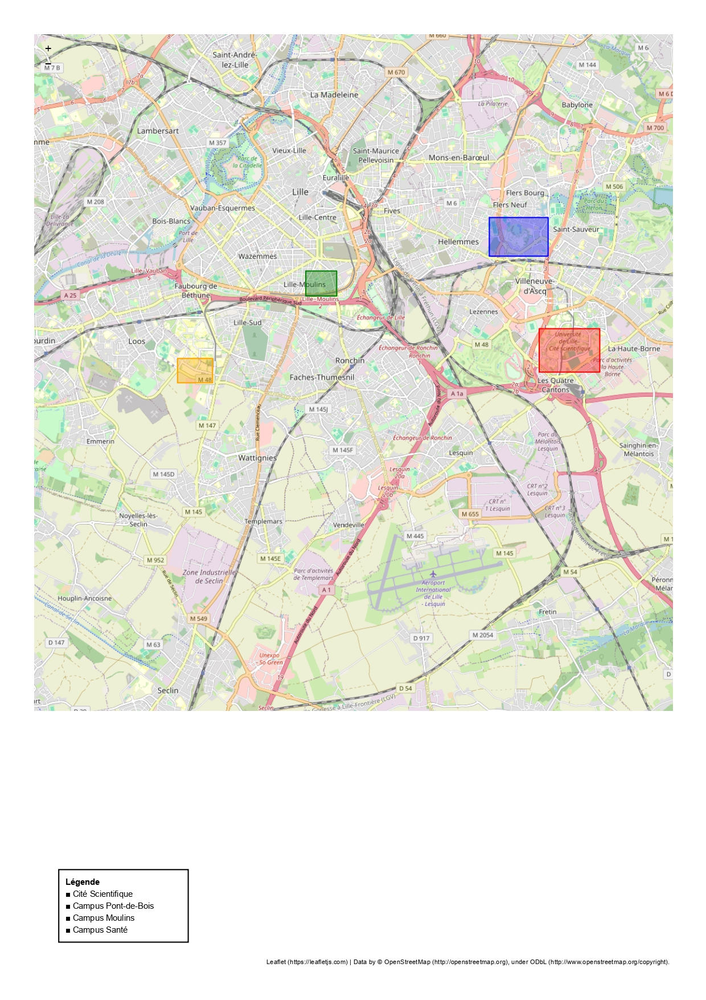
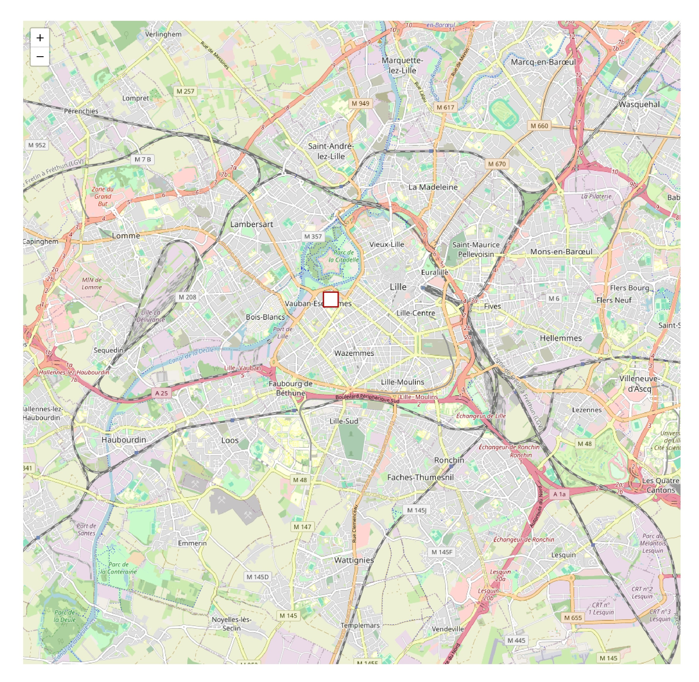
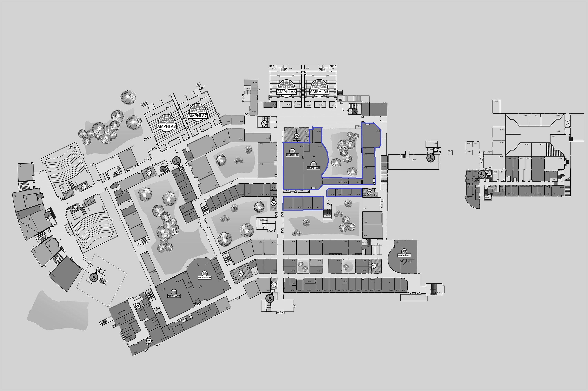

# I. L'université de Lille

## Rapide historique
L’histoire de l’Université de Lille remonte à 1559, date de la fondation de l’université à Douai, qui constitue l’origine de l’institution. En 1887, les facultés sont transférées à Lille, marquant l’installation durable de l’université dans la métropole. Un tournant majeur survient en 1970 avec la division de l’établissement en trois entités : Lille 1 pour les sciences et technologies, Lille 2 pour le droit, la santé et la gestion, et Lille 3 pour les lettres, arts, sciences humaines et sociales. Cette organisation perdure plus de cinquante ans, jusqu’à la fusion de 2022, qui réunit de nouveau les trois universités en un seul établissement, donnant naissance à l’actuelle Université de Lille.

## Condition materielles 

L’Université de Lille se caractérise par un éclatement de ses campus autour de la métropole lilloise. Le premier déplacement en périphérie concerne le campus Santé, installé dès les années 1950 à la frontière de Loos. Dans les années 1970, les campus de la Cité scientifique et de Pont-de-Bois sont créés à Villeneuve-d’Ascq, dans la continuité de ce mouvement. La faculté de droit, initialement implantée à Pont-de-Bois, est ensuite rapatriée à Lille dans les années 1990 avec l’ouverture du campus Moulins. Enfin, les sites de Roubaix, Tourcoing et Flers-Château constituent les implantations les plus éloignées du centre lillois. À noter qu’après le départ de la faculté des Lettres, les bâtiments du centre-ville ont été réinvestis par Sciences Po Lille, illustrant un recyclage partiel des anciens locaux universitaires.

Ce mouvement de dispersion s’explique d’abord par l’exiguïté des locaux historiques, incapables d’absorber une population étudiante en forte croissance. Il s’inscrit également dans un mouvement national des années 1960–1970, marqué par la création de « campus à l’américaine », de vastes sites périphériques permettant d’étendre les infrastructures, de moderniser les équipements et d’organiser plus rationnellement les disciplines. Certains interprètent aussi ces choix à la lumière des événements de Mai 68, estimant que l’État souhaitait réduire les fortes concentrations étudiantes en centre-ville, alors perçues comme des foyers potentiels de contestation. Toutefois, les justifications officielles mettent avant tout en avant la recherche de locaux plus vastes, plus modernes et plus adaptés aux besoins croissants.

En termes d’accessibilité et de conditions de vie étudiante, l’ensemble des campus est desservi par le métro et le bus, même si les distances avec le centre de Lille varient et impliquent des différences notables de temps de trajet. Les bâtiments universitaires présentent par ailleurs une grande diversité d’âges : les plus anciens sont ceux de la faculté de médecine, dont certaines parties remontent aux années 1930–1950 ; viennent ensuite ceux de Pont-de-Bois et de la Cité scientifique (années 1960–1970), puis le campus Moulins dans les années 1990. Les implantations de Roubaix, Tourcoing et Flers-Château datent quant à elles majoritairement des années 2010. Des programmes de rénovation ont été engagés, notamment à la Cité scientifique et à Pont-de-Bois, portant sur la modernisation des bibliothèques, la mise aux normes et des opérations de désamiantage. 

Il existe également une université privée catholique, fondée en 1875, implantée au nord de Lille dans le quartier Vauban-Esquermes. L'universsité catholique a connu une croissance continue au cœur même de la ville surtout depuis les années 2000 ou elle s’est développée à la fois en effectifs et en surface, en rénovant ses bâtiments historiques, en construisant de nouveaux espaces d’enseignement et en créant de nombreux équipements (résidences, pôles de santé, incubateurs, espaces interdisciplinaires). Ce modèle d’université intégrée dans le tissu urbain contraste fortement avec celui de l’université publique, éclatée sur plusieurs campus éloignés. 

# II. La place de l'histoire au sein du campus Pont de bois

A la connaissance il y a trois facultés. La Faculté des Humanités, Faculté des Langues, Cultures et Sociétés, Faculté de Psychologie et des Sciences de l'Éducation et de la Formation. après il y a des facultés multi cite donc il faut faire attention. Dans la faculté des humanités on retrouve les département d'Arts, d'Histoire, d'Histoire de l'art et Archéologie, de Langues et cultures antiques, de Lettres modernes, de Philosophie, de Sciences du langage. Le département d'histoire et histoire de l'art se trouve ici :

Ensuite un découpage a lieu entre Antiquité et le reste des périodes pour les labo mais ils sont voués à fusionner dans les mois à venir. HALMA et IRHIS. Il y a l'histoire de l'art et l'archéo dedan bien ur. L'histoire médiévale se fait donc à l'IRHIS même s'il est possible d'en faire dans le laboratoire STL — « Savoirs, Textes, Langage »  et ALITHILA — « Analyses littéraires et histoire de la langue »  de manière indirecte. 

Le laboratoire d’histoire IRHIS est situé dans le bâtiment principal (bâtiment A) du campus Pont-de-Bois. Il occupe une partie proche de l’entrée principale, mais au rez-de-chaussée ou plutôt au sous-sol, et bénéficie d’une surface relativement importante au sein du bâtiment. Cet espace est appelé à s’étendre avec la fusion prochaine avec le laboratoire d’histoire antique HALMA. Il est également possible que la localisation du laboratoire évolue au sein du campus dans le futur. 

Je manque d'informations pour pouvoir comparer le cursus d'histoire aux autres cursus du campus. 

# IV. La place de la médiévale dans le laboratoire

## La mandature actuelle

Le laboratoire bénéficie d’une forte représentation des médiévistes dans sa direction actuelle (2020-2025). Charles Meriaux en assure la direction, accompagné d’Élise Baillieul, Christopher Fletcher et Marie Derrien. Ainsi, sur les quatre membres de la direction, trois sont médiévistes, la seule représentante de l’histoire contemporaine étant Marie Derrien. Cette prédominance se retrouve également dans la gestion des axes de recherche : Pôle 1 est dirigé par Justine Faure et Étienne Hamon, Pôle 2 par Delphine Bière et Romy Sanchez, Pôle 3 par Marjorie Meiss et Mathieu Vivas, et l’Axe transverse par Mathieu Beaud et Tristan Martine. Sur les huit responsables d’axes, quatre sont médiévistes, soit exactement la moitié.

Chez les représentants des doctorants, la moitié sont également médiévistes : les titulaires sont Camille Paccou et Éloi Vincendet, tandis que les suppléants sont Hugo Dehongher et Thomas Ruckebusch. 

Enfin, pour le conseil du laboratoire, les membres élu·e·s du collège Chercheurs/Enseignants-Chercheurs sont Laurent Brassart, Marc Gil, Élodie Lecuppre-Desjardin, Sylvain Lesage, Sophie Mouquin, Pauline Prevost-Marcilhacy, Romy Sanchez, Jean-Baptiste Santamaria et Mélanie Traversier, ce qui montre une représentation médiévale assez équilibrée et représentative.

## La précédente mandature

Lors de la précédente mandature (2015-2019), la direction du laboratoire était composée de deux contemporanéistes, Mathieu De Oliveira et Stéphane Michonneau et d’une médiéviste, Esther Dehoux, ce qui montre une représentation médiévale plus faible qu’actuellement. La gestion des axes de recherche comptait également moins de médiévistes : Axe 1 était dirigé par Gil Bartholeyns et Manuel Charpy, Axe 2 par Anne-Marie Legaré et Chang Ming Peng, Axe 3 par Catherine Denys et Hervé Leuwers, et Axe 4 par Gabriel Galvez-Behar et Élodie Lecuppre-Desjardins. Sur les huit responsables, trois étaient médiévistes, ce qui restait toutefois significatif.

Au niveau des représentants de l’UFR SHAP, Charles Meriaux était titulaire et Marc Gil suppléant, tous deux médiévistes, ce qui constituait un point fort pour la médiévistique. En revanche, la représentation dans les membres enseignants-chercheurs élus était plus faible : Laurent Brassart, Frédéric Chappey, Carole Christen, Esther Dehoux, Étienne Hamon, Jean Martinant de Préneuf, Isabelle Paresys, Isabelle Surun, Florence Tamagne et Béatrice Touchelay, avec une proportion limitée de médiévistes.

Chez les doctorants élus, Jean d’Andlau, Yaël Gagnepain, Mathias Pareyre et Arthur Pinta étaient représentés, mais aucun n’était médiéviste. Enfin, parmi les représentants institutionnels, on compte deux médiévistes sur quatre : Claire Chatelain et Christopher Fletcher pour le CNRS, Thomas Golsenne pour le SCV, et Philippe Darriulat pour Sciences Po Lille.

Globalement, la mandature précédente montre une représentation médiévale présente mais moins marquée qu’actuellement, avec une concentration surtout au niveau des axes et de l’UFR, tandis que la présence dans les élus enseignants-chercheurs et doctorants restait limitée.

Je n'ai pas eu des informations sur les mandatures précédentes pour le moment. 

## Les titulaires 

Il y a 53 médiévistes parmis les titulaires 12 ce qui fait 22%. Pour ce qui est des émérite. Sur les membres honoraires 9 sur 19 soit 47%. CNRS 1/2 soit 50%

## Les doctorants 
Il y a actuellement 13 doctorants en histoire médiévale à Lille sur les 65 doctorants ce qui représente 20% des doctorants. Depuis 206 il y a eu 171 docteur au sein du laboratoire et sur ce pool 52 médiéviste ce qui correspond à 30%. Pour ce qui est des post-doc il y a 1 médiéviste sur les 3 ce qui fait 33%. Aucun médiéviste n'est présent en co-direction. 

Les doctorants possèdent une salle commune qui se trouve dans le couloir du laboratoire. (Je suis en train de calculer le taux de présence des médiévistes par rapport au reste). Il existe aussi une salle de travaille specifique pour les médiévisstes seul, la salle synergia dan le couloir du laboratoire. Elle est reservé aux médiévistes du projet Sinergia. Elle est occupé que un seul doctorant principalement. Au début de l'année 2024 elle était beaucoup plus utilisée mais il y a eu un cass de harcelement de l'un des membres ud projet au sein du laboratoire donc les autres ne viennent plus au bureau sauf la personne fautive. Cette salle est vouée à disparaitre via la fusion, à cause du faible usage. Les doctorantss peuvent aussi travailler à la bibliothèque du laboratoire george lefbre quand plus de place en salle des docs ou trop bruillant. Il y ausi la bibliothèqe michelet specialisé en histoire mais ouverte à tous et non pas à partir de L3 pour Geogrbes lefebvre. Il est aussi possible de travailler à la bibliothèque centrale meme si depuis quelques années elle est en travaux. 

## La bibliothèque George lefebvre 

