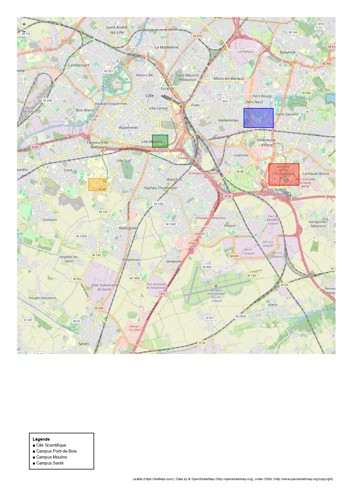
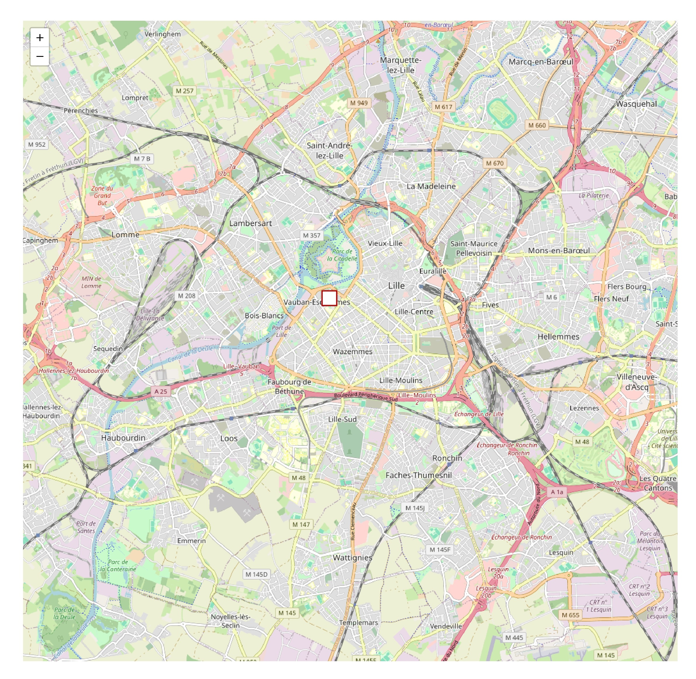
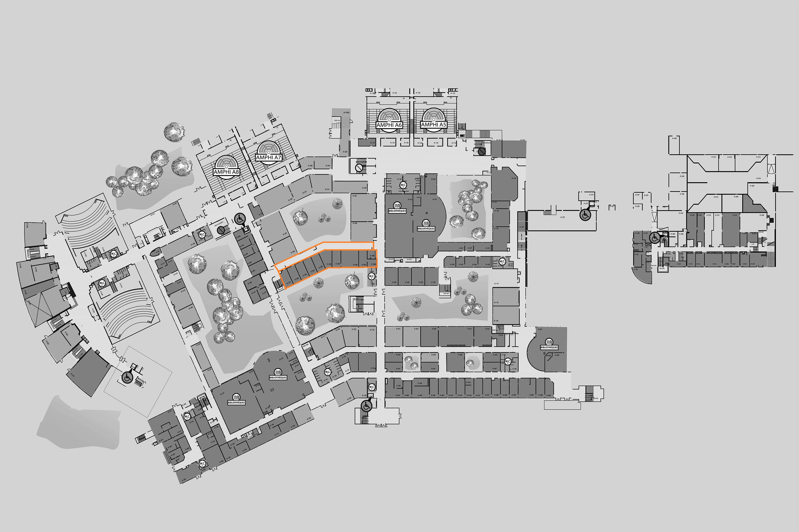
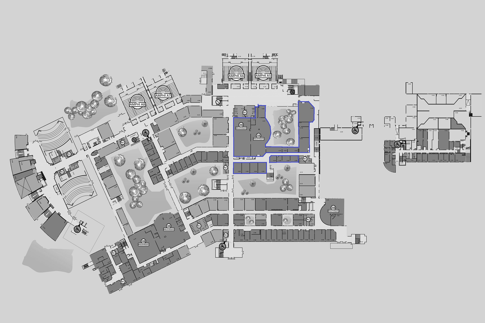

# I. L'université de Lille

## Rapide historique

L’histoire de l’Université de Lille remonte à 1559, date de la fondation de l’université à Douai, qui constitue l’origine de l’institution. En 1887, les facultés sont transférées à Lille, marquant l’installation durable de l’université dans la métropole. Un tournant majeur survient en 1970 avec la division de l’établissement en trois entités : Lille 1 pour les sciences et technologies, Lille 2 pour le droit, la santé et la gestion, et Lille 3 pour les lettres, arts, sciences humaines et sociales. Cette organisation perdure plus de cinquante ans, jusqu’à la fusion de 2022, qui réunit de nouveau les trois universités en un seul établissement, donnant naissance à l’actuelle Université de Lille.

## Condition materielles 

L’Université de Lille se caractérise par un éclatement de ses campus autour de la métropole lilloise. Le premier déplacement en périphérie concerne le campus Santé, installé dès les années 1950 à la frontière de Loos. Dans les années 1970, les campus de la Cité scientifique et de Pont-de-Bois sont créés à Villeneuve-d’Ascq, dans la continuité de ce mouvement. La faculté de droit, initialement implantée à Pont-de-Bois, est ensuite rapatriée à Lille dans les années 1990 avec l’ouverture du campus Moulins. Enfin, les sites de Roubaix, Tourcoing et Flers-Château constituent les implantations les plus éloignées du centre lillois. À noter qu’après le départ de la faculté des Lettres, les bâtiments du centre-ville ont été réinvestis par Sciences Po Lille, illustrant un recyclage partiel des anciens locaux universitaires.

Ce mouvement de dispersion s’explique d’abord par l’exiguïté des locaux historiques, incapables d’absorber une population étudiante en forte croissance. Il s’inscrit également dans un mouvement national des années 1960–1970, marqué par la création de « campus à l’américaine », de vastes sites périphériques permettant d’étendre les infrastructures, de moderniser les équipements et d’organiser plus rationnellement les disciplines. Certains interprètent aussi ces choix à la lumière des événements de Mai 68, estimant que l’État souhaitait réduire les fortes concentrations étudiantes en centre-ville, alors perçues comme des foyers potentiels de contestation. Toutefois, les justifications officielles mettent avant tout en avant la recherche de locaux plus vastes, plus modernes et plus adaptés aux besoins croissants.

En termes d’accessibilité et de conditions de vie étudiante, l’ensemble des campus est desservi par le métro et le bus, même si les distances avec le centre de Lille varient et impliquent des différences notables de temps de trajet. Les bâtiments universitaires présentent par ailleurs une grande diversité d’âges : les plus anciens sont ceux de la faculté de médecine, dont certaines parties remontent aux années 1930–1950 ; viennent ensuite ceux de Pont-de-Bois et de la Cité scientifique (années 1960–1970), puis le campus Moulins dans les années 1990. Les implantations de Roubaix, Tourcoing et Flers-Château datent quant à elles majoritairement des années 2010. Des programmes de rénovation ont été engagés, notamment à la Cité scientifique et à Pont-de-Bois, portant sur la modernisation des bibliothèques, la mise aux normes et des opérations de désamiantage. 

Il existe également une université privée catholique, fondée en 1875, implantée au nord de Lille dans le quartier Vauban-Esquermes. L'universsité catholique a connu une croissance continue au cœur même de la ville surtout depuis les années 2000 ou elle s’est développée à la fois en effectifs et en surface, en rénovant ses bâtiments historiques, en construisant de nouveaux espaces d’enseignement et en créant de nombreux équipements (résidences, pôles de santé, incubateurs, espaces interdisciplinaires). Ce modèle d’université intégrée dans le tissu urbain contraste fortement avec celui de l’université publique, éclatée sur plusieurs campus éloignés. 

# II. La place de l'histoire au sein du campus Pont de bois

Le campus de la Connaissance regroupe trois facultés principales : la Faculté des Humanités, la Faculté des Langues, Cultures et Sociétés, ainsi que la Faculté de Psychologie et des Sciences de l’Éducation et de la Formation. Certaines facultés étant réparties sur plusieurs sites, il convient de prêter une attention particulière à leur localisation. La Faculté des Humanités comprend plusieurs départements, notamment les Arts, l’Histoire, l’Histoire de l’art et l’Archéologie, les Langues et cultures antiques, les Lettres modernes, la Philosophie et les Sciences du langage. Le département d’Histoire et d’Histoire de l’art est situé ici :

Par le passé, l’organisation des laboratoires reposait sur un découpage chronologique distinguant l’Antiquité des autres périodes. Les recherches sur l’Antiquité étaient ainsi menées au sein du laboratoire HALMA, tandis que celles consacrées aux périodes médiévale, moderne et contemporaine relevaient principalement de l’IRHIS. L’histoire médiévale se pratiquait donc surtout à l’IRHIS, même s’il était également possible d’en aborder certains aspects de manière plus indirecte dans d’autres laboratoires, notamment STL (« Savoirs, Textes, Langage ») et ALITHILA (« Analyses littéraires et histoire de la langue »), à travers des approches linguistiques ou littéraires. Ce découpage a toutefois pris fin avec la fusion des laboratoires intervenue à partir du 1er janvier.

Le laboratoire d’histoire IRHIS est situé dans le bâtiment principal (bâtiment A) du campus Pont-de-Bois. Il occupe un espace relativement vaste à proximité de l’entrée principale, au rez-de-chaussée inférieur (ou sous-sol). Avec la fusion récente avec le laboratoire d’histoire antique HALMA, l’organisation des locaux est appelée à évoluer, sans qu’il soit encore certain que les deux équipes soient regroupées dans un même espace ou installées dans un nouveau lieu au sein du bâtiment.

# IV. La place de la médiévale dans le laboratoire

## La mandature 2026-2030

La mandature actuelle du nouveau laboratoire HARTIS se caractérise par une place toujours importante accordée aux études médiévales. La direction est assurée par Charles Mériaux (médiéviste) et assisté de Sandrine Huber (antiquisante) en tant que directrice adjointe. Cette importance se reflète également dans la composition des responsables de pôles scientifiques, puisque quatre médiévistes figurent parmi les dix responsables. Les pôles sont répartis entre le pôle 1 « Création, transmission, savoir », dirigé par Jean-François Condette et Caroline Husquin, le pôle 2 « Normes, crises, transitions », sous la responsabilité de Frédérique Blaizot et Élodie Lecuppre-Desjardin, et le pôle 3 « Matérialité – immatérialité », animé par Sylvie Donnat et Mathieu Vivas. À ces pôles s’ajoutent deux pôles transversaux : « Humanités numériques », coordonné par Mathieu Beaud et Alexis Duvaut-Robine (SRA-DRAC Hauts-de-France), et « Les Antiquités et leurs réceptions. Pratiques, interprétations et interactions », dirigé par Charles Delattre et Chang Ming Peng. L’ensemble confirme le poids des médiévistes au sein de la gouvernance scientifique du laboratoire, même si celui-ci étant issu d’une fusion récente, les données disponibles demeurent encore partielles.

## La mandature 2020-2025

Pendant la mandature 2020-2025, le laboratoire bénéficie d’une forte représentation des médiévistes. Dans sa direction il y a Charles Meriaux (médiéviste), d’Élise Baillieul (médiéviste), Christopher Fletcher (médiéviste) et Marie Derrien (contemporanéiste). Ainsi, sur les quatre membres de la direction, trois sont médiévistes. Cette dominance se retrouve également dans la gestion des axes de recherche : Pôle 1 est dirigé par Justine Faure et Étienne Hamon (médiéviste), Pôle 2 par Delphine Bière et Romy Sanchez, Pôle 3 par Marjorie Meiss et Mathieu Vivas (médiéviste), et l’Axe transverse par Mathieu Beaud(médiéviste) et Tristan Martine(médiéviste). Sur les huit responsables d’axes, quatre sont médiévistes, soit exactement la moitié. Chez les représentants des doctorants, la moitié sont également médiévistes : les titulaires sont Camille Paccou (médiéviste) et Éloi Vincendet, tandis que les suppléants sont Hugo Dehongher (médiéviste) et Thomas Ruckebusch. Enfin, pour le conseil du laboratoire, les membres élu·e·s du collège Chercheurs/Enseignants-Chercheurs sont Laurent Brassart, Marc Gil (médiéviste), Élodie Lecuppre-Desjardin (médiéviste), Sylvain Lesage, Sophie Mouquin, Pauline Prevost-Marcilhacy, Romy Sanchez, Jean-Baptiste Santamaria (médiéviste) et Mélanie Traversier, ce qui montre une bonne représentation de médiéviste encore une fois.

## La mandature 2015-2019

Lors de la mandature 2015-2019, la représentation des médiévistes dans l’organisation du laboratoire apparaît plus limitée. La direction était composée de deux contemporanéistes, Mathieu De Oliveira et Stéphane Michonneau, et d’une médiéviste, Esther Dehoux. La répartition des responsabilités au sein des axes de recherche comptait également moins de médiévistes : l’axe 1 était dirigé par Gil Bartholeyns (médiéviste) et Manuel Charpy, l’axe 2 par Anne-Marie Legaré (médiévite) et Chang Ming Peng, l’axe 3 par Catherine Denys et Hervé Leuwers, et l’axe 4 par Gabriel Galvez-Behar et Élodie Lecuppre-Desjardins (médiéviste). Sur les huit responsables d’axes, trois étaient médiévistes, ce qui constituait néanmoins une présence non négligeable. La représentation des médiévistes au sein du conseil du laboratoire était également plus faible : celui-ci comprenait Laurent Brassart, Frédéric Chappey, Carole Christen, Esther Dehoux (médiéviste), Étienne Hamon (médiéviste), Jean Martinant de Préneuf, Isabelle Paresys, Isabelle Surun, Florence Tamagne et Béatrice Touchelay. Enfin, parmi les représentants des doctorants — Jean d’Andlau, Yaël Gagnepain, Mathias Pareyre et Arthur Pinta — aucun n’était médiéviste.

Je n'ai pas eu des informations sur les mandatures précédentes pour le moment. 

## Les titulaires 

Au sein du laboratoire HARTIS, on compte trois titulaires CNRS, dont un médiéviste, soit environ 33 % des titulaires. Parmi les membres émérites, trois sur douze sont médiévistes soit 25%. Les médiévistes occupent quinze postes permanents sur un total de soixante-dix-huit soit environ 19%. En revanche, je ne dispose pas d’informations concernant la répartition des membres honoraires.

Avant la fusion, l’ancien laboratoire IRHIS comptait 15 médiévistes parmi les 53 titulaires, soit environ 28 %. Parmi les membres émérites, 4 sur 10 étaient médiévistes, soit 40 %. Les membres honoraires comprenaient 9 médiévistes sur un total de 19, ce qui représentait environ 47 %. Enfin, les postes CNRS comptaient 1 médiéviste sur 2, soit 50 %.

## Les doctorants/post-doctorants 

Dans le nouveau laboratoire HARTIS, les post-doctorants sont au nombre de cinq, dont trois médiévistes, soit 60 % de cette catégorie. Du côté des doctorants, 15 sur 102 peuvent être considérés comme médiévistes (en incluant deux doctorants précédemment rattachés au laboratoire HALMA), ce qui représente environ 15 % de l’effectif. Parmi les ATER, 3 sur 15 sont médiévistes, soit 20 % de représentation. Dans l’ancien laboratoire IRHIS, on comptait 13 doctorants en histoire médiévale sur un total de 65 doctorants, soit environ 20 %, ainsi qu’un post-doctorant médiéviste sur trois, soit 33 %. Enfin, depuis 2006, le laboratoire a formé 171 docteurs, parmi lesquels 52 médiévistes, ce qui représente environ 30 % de l’ensemble.

Les doctorants disposent d’une salle commune située dans le couloir du laboratoire. Il existe également une salle de travail spécifique pour les médiévistes, réservée aux membres du projet Sinergia. Cette salle n’est actuellement occupée que par un seul doctorant. Au début de l’année 2024, elle était beaucoup plus utilisée, mais à la suite d’un incident de harcèlement impliquant un membre du projet, les autres doctorants ont cessé de fréquenter la salle, à l’exception de la personne concernée. Cette salle est destinée à disparaître avec la fusion des laboratoires, en raison de son faible usage. Les doctorants peuvent aussi travailler à la bibliothèque du laboratoire Georges Lefebvre lorsque la salle de documentation est trop bruyante ou manque de place. La bibliothèque Michelet, spécialisée en histoire mais ouverte à tous, constitue une autre option. Il est également possible d’utiliser la bibliothèque centrale, bien que celle-ci soit en travaux depuis quelques années.

## Les bibliothèques

Le laboratoire HARTIS dispose de trois bibliothèques : Georges Lefebvre, Sciences de l’Antiquité et Vandier. Seule la bibliothèque Georges Lefebvre contient des ouvrages d’histoire médiévale, tandis que les autres sont consacrées à l’Antiquité. Cette prédominance de l’Antiquité reflète la fusion récente des laboratoires, et il reste à observer comment l’organisation des collections évoluera à l’avenir.

La bibliothèque Georges Lefebvre doit son identité initiale aux fonds légués par deux historiens : Georges Espinas, médiéviste, et Georges Lefebvre, historien moderniste. Depuis lors, les collections se sont enrichies grâce à des crédits obtenus par les enseignants-chercheurs du laboratoire (IUF, ANR…) et par la bibliothèque elle-même (CNL, CollEx…). Les fonds d’histoire médiévale bénéficient du label CollEx, collection d’excellence. Parmi les fonds d’histoire, la bibliothèque possède notamment des collections sur le Haut Moyen Âge et sur la Bourgogne.

En matière d’archives, la bibliothèque conserve sept fonds dits « spécifiques », mais aucun ne concerne directement la période médiévale. Les sources médiévales locales se trouvent principalement dans les bibliothèques municipales, départementales et régionales, bien que l’on note la présence de quelques documents apportés par un ancien médiéviste de l’université, Alain Derville. Ce dernier est le seul médiéviste parmi les cinq enseignants-chercheurs dont les archives sont conservées à la bibliothèque Georges Lefebvre.
Il n'y a pas de bases de données qui porte sur de la médiévale actuellement. Même si des projet numériques sont en cours

## Les programmes de recherche

Parmi les projets de recherche actuellement en cours au laboratoire HARTIS, trois sur douze portent sur l’histoire médiévale. Pour les projets passés, un seul sur onze concernait cette période. S’agissant des projets numériques, trois sur onze sont liés à l’histoire médiévale. La promotrice principale en matière de projets de recherche est Élodie Desjardins.

# Bases de données 

Le laboratoire ne dispose d’aucune base de données spécifiquement consacrée à l’histoire médiévale.

# L'Enseignement de l'histoire médiévale aux étudiants

## Licence
Selon le guide des études du parcours Histoire, un équilibre est donné aux quatre grandes périodes historiques. L’histoire de l’art et l’archéologie, quant à elles, sont regroupées dans un parcours spécifique et ne sont pas intégrées dans cette répartition.

En L1, un cours de Haut Moyen Âge (Ve–XIe siècle), comprenant un CM et un TD, est proposé au second semestre. Il relève du bloc 1, « Interpréter le matériau historique en fonction des représentations de ceux qui l’ont produit », ainsi que du bloc 2, « Exploiter des sources historiques et des productions scientifiques ». Dans le bloc 4, « Construire et valoriser sa formation en histoire », le sous-bloc 3 consacré à la lecture et à l’écriture de l’histoire propose plusieurs enseignements : Femmes et pouvoir au Moyen Âge (Ve–XVe siècle), Les populations médiévales et leur environnement (Ve–XIIe siècle), Les royaumes du Nord au Haut Moyen Âge et Matrimoine et richesse des femmes (XIIIe – début XVIe siècle). Le sous-bloc 2, « Ouverture pluridisciplinaire », inclut notamment Les Carolingiens : politique et culture au service de Dieu (VIIIe–IXe siècles) et Les objets du Moyen Âge dans les musées.

En L2, au premier semestre, un CM et un TD de Bas Moyen Âge intitulé L’Europe médiévale : XIIe–XVe siècle sont proposés dans les blocs 1 et 2, comme en L1. Dans le bloc 3, « Exprimer et transmettre un contenu historique à l’écrit et à l’oral », le sous-bloc 1 consacré à la pratique de l’expression écrite propose Pratique de l’écrit – Histoire médiévale. Dans le bloc 4, le sous-bloc 2 « Ouverture pluridisciplinaire » comprend Littérature médiévale, Contacts et conflits en Méditerranée (VIe–XIIIe siècle) et Archéologie médiévale. Le sous-bloc 3, dédié à l’approfondissement en histoire, inclut Les images au Moyen Âge et Manger et boire au Moyen Âge.

En L3, les étudiant·es suivent des CM et TD couvrant l’ensemble des quatre périodes historiques, mais peuvent choisir parmi quatre thèmes spécifiques pour la période médiévale : Église et pouvoir en France et en Germanie au Moyen Âge central (IXe–XIIe siècles), Temps mesuré, temps pensé, temps vécu à la fin du Moyen Âge (XIVe–XVe siècles), La Flandre médiévale et Justice de Dieu et justices des hommes (Ve–XVe siècle). Comme dans les années précédentes, le CM relève du bloc 1, tandis que le TD appartient au bloc 3. Dans le bloc 2, « Exploiter des sources historiques et des productions scientifiques », les étudiants peuvent suivre Paléographie médiévale et Sources du Haut Moyen Âge. Enfin, le bloc 3 propose dans son sous-bloc 2 Littérature médiévale et Le Moyen Âge dans les arts du XIXe siècle, et dans son sous-bloc 3 Femmes et pouvoir (XIIIe–XVe siècle) ainsi que Les cours princières au Moyen Âge.

## Master 

Pour se spécialiser en histoire médiévale, les étudiant·es doivent candidater au Master « Histoire européenne ». Un autre master, intitulé « Mondes anciens », est spécifiquement dédié à l’Antiquité. Le Master Histoire européenne est un parcours trans-période, permettant d’étudier l’époque médiévale, l’époque moderne et l’époque contemporaine, avec des enseignements communs à toutes les périodes et d’autres plus spécialisés selon l’époque. En général, deux séminaires différents sont proposés par période. Pour l’histoire médiévale, les séminaires actuels sont : « Temps et espaces du pouvoir en Europe du Nord-Ouest » (Bas Moyen Âge) et « Histoire culturelle et religieuse, Ve‑XIIIe siècle ». Au M1 S1, les étudiant·es choisissent une option d’outils de recherche (paléographie ou latin médiéval), complétée par une initiation obligatoire à l’archivistique. Au M1 S2, l’archivistique disparaît et une nouvelle option, l’archéologie (incluant des aspects médiévaux), est proposée, tout en conservant le choix entre paléographie et latin médiéval, mais pour un seul enseignement à inscrire. Au M2 S1, les cours magistraux sont maintenus et un unique outil de recherche doit être choisi, tandis qu’au M2 S2, seul le séminaire de médiévale est conservé. Sur l’ensemble des deux années, un séminaire d’histoire européenne, dispensé en français et en anglais, est également proposé, abordant ponctuellement des thématiques médiévales.

